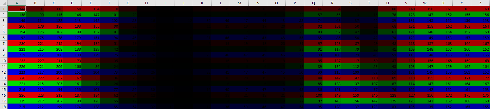
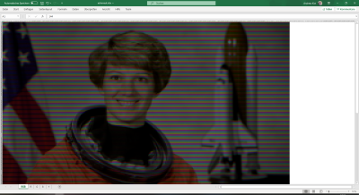
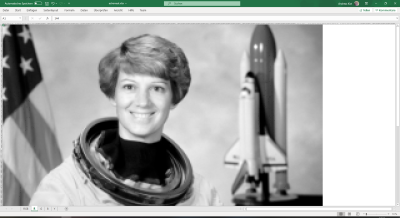
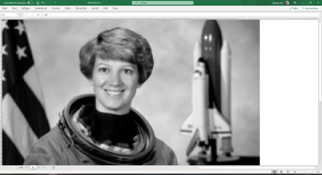
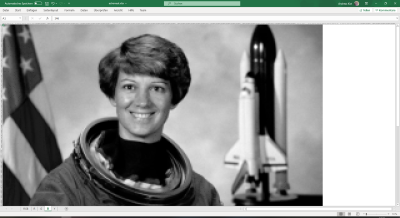
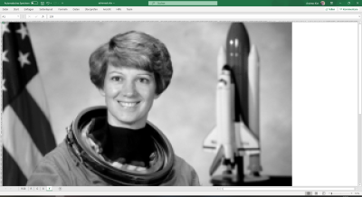

# ImagesAreExcelSheets
This repository contains a Jupyter notebook that converts a given image to an Excel file.

## Usage

Just download the Jupyter notebook and run it, it will automatically create the `astronaut.xlsx` Excel file as available here on the Github repository (you may download it also right away for your convenience). The Jupyter notebook has the following dependencies:

* xlsxwriter
* Numpy
* Scikit-Image
* tqdm (only for fancy progressbar, no particular use otherwise)

The total scripts runs on my notebook in less than a minute.

## Screenshots

This is what you can expect from the Excel file:

### Zoom-In on the RGB image

### RGB image

### Red channel

### Green channel

### Blue channel

### Luminance channel

